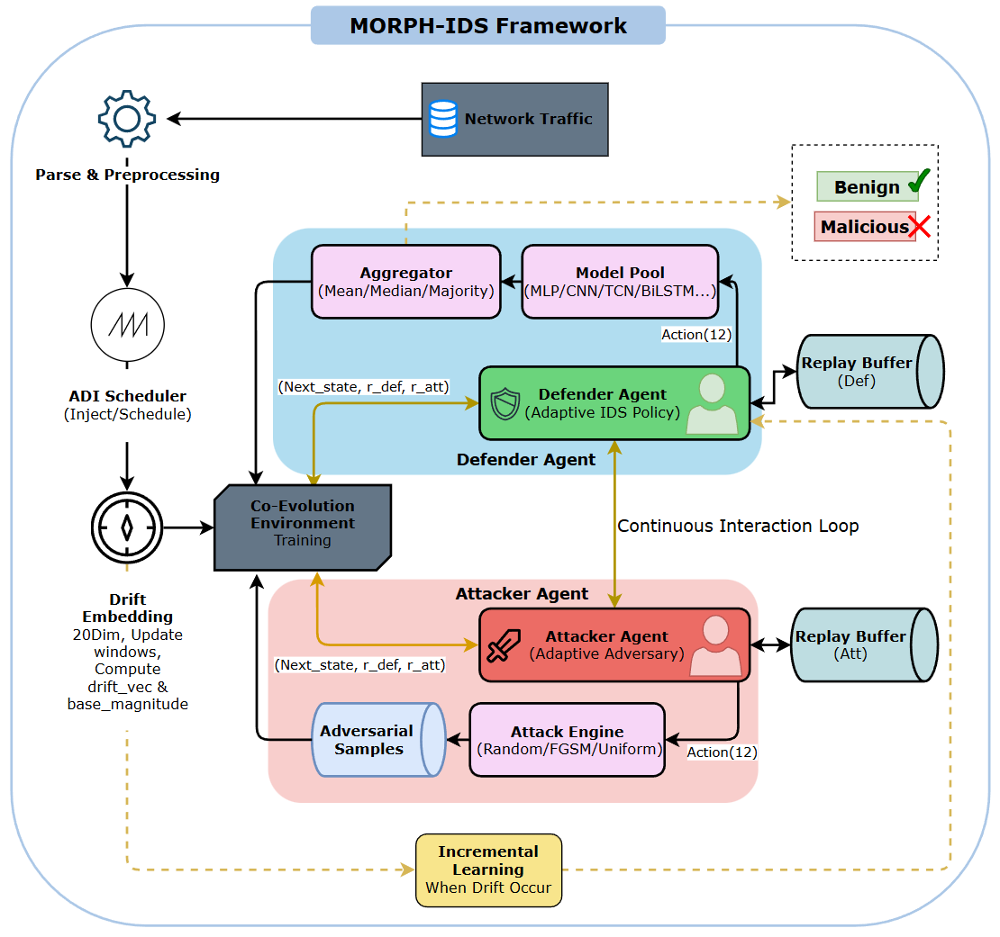

**MORPH-IDS**
---
Title:
**MORPH-IDS: A Context-Driven Multi-Agent Reinforcement Learning Framework for Drift-Aware Moving Target Defense in Adversarial-Robust Intrusion Detection**
---
Abstract:

With the explosive growth in the scale and complexity of network infrastructures, cloud computing, and IoT, the cyber-attack surface has expanded significantly, posing major challenges for Network Intrusion Detection Systems (NIDS). Although NIDS play a critical role in cybersecurity, traditional NIDS based on static Machine Learning (ML) models are revealing serious weaknesses in non-stationary environments. Specifically, their reliance on fixed training data makes them vulnerable to concept drift and sophisticated adversarial attacks, where attackers deliberately exploit blind spots in the models or perform data poisoning.

To address these pressing challenges, this thesis proposes a novel adaptive defense framework that integrates Moving Target Defense (MTD) with Multi-Agent Reinforcement Learning (RL). The system is modeled as a co-evolutionary game between a Defender agent—responsible for optimizing the selection and configuration of models from a pool of defensive models—and an Attacker agent that continuously learns to generate perturbations to evade detection. The architecture is built upon a Dueling Double Deep Q-Network (DQN) combined with a Boltzmann exploration strategy, enabling the defense posture to continuously change and remain unpredictable.

To explicitly address concept drift, we introduce an advanced 20-dimensional Drift Embedding technique, which provides agents with real-time situational awareness of distributional shifts and potential poisoning signals. This capability enables several adaptive mechanisms, including change-point detection, continual learning to prevent catastrophic forgetting, and a self-paced curriculum learning strategy that facilitates efficient learning from evolving data distributions.

Learning efficiency is further accelerated through Potential-Based Reward Shaping (PBRS), while system robustness is enhanced by a poisoning-aware Prioritized Experience Replay (PER) buffer and an adversarial denoiser module.

Experimental results on the CIC-IDS2017 benchmark dataset demonstrate the superior effectiveness of the proposed approach compared to static models. The system achieves a detection accuracy exceeding 90% while maintaining 85% robustness even under adversarial drift conditions. The integration of PBRS accelerates convergence by 2.7×, enabling rapid adaptation to emerging threats. Notably, the system also effectively mitigates poisoning attacks, achieving 88% accuracy at a 5% poisoning rate.

By continuously altering the defensive configuration, the MTD strategy creates a dynamic and moving target, providing a proactive and intelligent solution for next-generation intrusion detection systems in modern cybersecurity environments.

Model:

